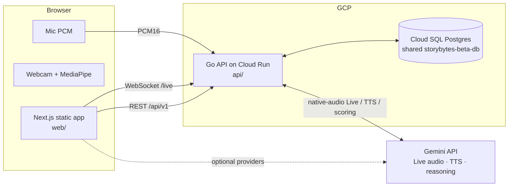
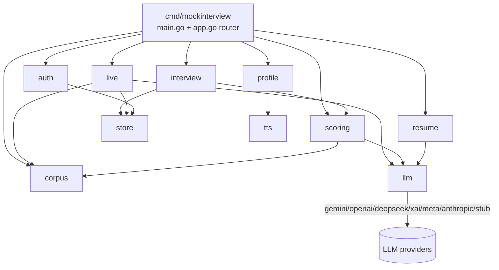
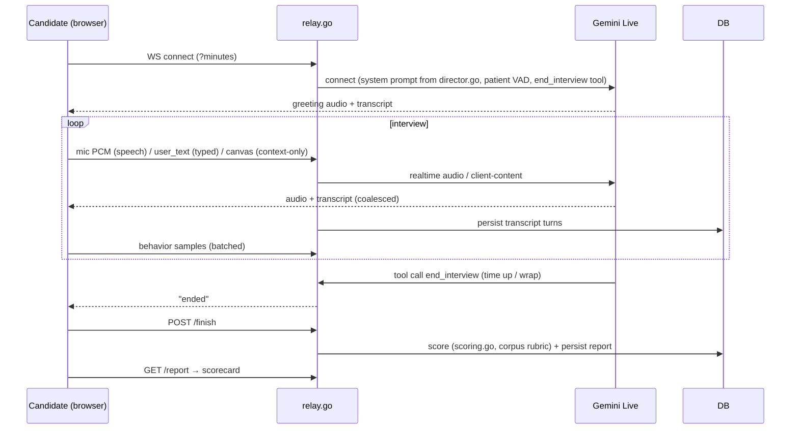
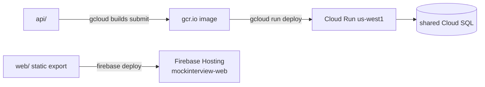

# Architecture — mockinterview.live

A modular monolith. Each concern is one package (backend) / one file (frontend),
so upgrading a piece means touching that file, not the whole app. This doc is the
map: diagrams + a "where do I change X" table.

## System overview



The web is a **static export on Firebase Hosting** (no server runtime). All logic
is the Go API. With no Gemini key the API uses a deterministic stub so everything
runs offline.

## Backend module map (`api/internal/*`)



| Package | Owns | Change here to… |
|---|---|---|
| `config` | env → typed config, `.env` load, provider resolution, admin allowlist, daily limit | add a setting / provider key / tier rule |
| `store` | pgx pool, **embedded migrations**, all SQL (users, sessions, transcripts, scores, reports, behavior…), the `Datastore` contract, and `store/memstore` (in-memory impl for tests) | change the schema (add `migrations/NNNN_*.sql`) or a query |
| `persona` | swappable catalogs — `voices.go`, `faces.go`, `personalities.go`, `languages.go`, `delivery.go` (each a one-file registry + validators) | add/change a voice, face, interviewer personality, language, or delivery style |
| `i18n` | server-side UI-string translation (`/i18n/translate`, LLM-backed, 1 MB-capped + ≤200 texts/call) | change how chrome strings are translated |
| `auth` | email/password + JWT, middleware | change auth / add an identity provider |
| `corpus` | load + validate + serve questions (`data/corpus/*.json`) | add/edit questions, change the question schema/validator |
| `llm` | provider-agnostic `Client` (Gemini/OpenAI/DeepSeek/xAI/Meta/Anthropic + stub) | add an LLM provider / change model defaults |
| `tts` | one-shot Gemini text-to-speech (voice previews) | change how voice previews are generated |
| `resume` | upload, PDF/DOCX/text extraction, LLM parse + review | change resume parsing / review |
| `profile` | interviewer config, voice/face catalogs, user profile, delete-account, voice preview | change catalogs / profile fields |
| `interview` | session lifecycle, transcript/workspace ingest, **finish→score**, report, results list, daily limit | change session flow, scoring trigger, report shape |
| `live` | **the interviewer**: `director.go` (system prompt, persona, per-domain pacing, phases) + `relay.go` (Gemini Live WebSocket, turn-taking, tools, transcript tap) | change interviewer behavior / the live transport |
| `scoring` | corpus-driven rubric evaluation, not-enough-info guard, per-dimension "assessed", persistence | change how interviews are scored |
| `behavior` (in store) | telemetry ingest + aggregation | change behavioral signals |
| `httpx` | RFC-7807 errors, JSON helpers | change error/response format |

**The interviewer's personality lives in exactly one file: `internal/live/director.go`.**
The provider used for reasoning is one env var (`LLM_PROVIDER`); the live voice is
always Gemini.

**Handlers depend on interfaces, not the database.** Each feature package declares
the small `Repo` interface it needs (consumer-defined). Both `*store.Store`
(Postgres) and `store/memstore.Mem` (in-memory) satisfy the `store.Datastore`
union, so the whole HTTP API is tested with `go test ./...` — no Postgres, no
Gemini key. If you add a store method: add it to the feature's `Repo`, to
`store.Datastore`, and to `memstore`.

## Frontend module map (`web/`)

The frontend mirrors the backend's feature isolation. **Each feature is one file
under `lib/features/`** owning its types + HTTP calls + mock + fixtures:

| File / dir | Owns |
|---|---|
| `lib/features/auth.ts` | register/login/me/logout + `User` type |
| `lib/features/profile.ts` | interviewer config, voice/face catalogs, profile, delete-account, voice preview |
| `lib/features/resume.ts` | upload / fetch / review + resume types + review mock |
| `lib/features/catalog.ts` | question catalog + `matchScore` fuzzy search + `QuestionSummary` |
| `lib/features/interview.ts` | session lifecycle, workspace/turn/behavior ingest, report, results, `liveUrl` |
| `lib/api.ts` | **thin composer** — intersects the slices into one `api` object; picks `http` vs `mock` via `NEXT_PUBLIC_MOCK`. Nothing calls `fetch` directly. |
| `lib/http.ts` | shared transport (base URL, bearer token, `req`, `wsBase`) |
| `lib/domain.ts` | cross-feature primitives (`Modality`, `Personality`, `Phase`) |
| `lib/types.ts`, `lib/mockdata.ts` | back-compat barrels re-exporting from features |
| `lib/live.ts` | live client: WS transport, mic/voice, captions, nudge, **reconnect w/ backoff**, ended |
| `lib/behavior.ts` | in-browser MediaPipe + luminance behavioral capture — **opt-in only** (gated on `localStorage["mi.cameraConsent"]==="granted"`; no-ops otherwise) |
| `lib/voicePreview.ts` | real Gemini voice preview (+ browser fallback), play/stop |
| `lib/features/i18n.ts` | translation + language-list slice (http + mock twin); consumed by `lib/i18n.tsx` via `api` (never a raw `fetch`) |
| `lib/features/achievements.ts` | pure client-side derivation over already-fetched sessions (no transport — intentional composer exception) |
| `lib/i18n.tsx` | language context + `t()`; personality & language catalogs are fetched from the backend (`/personalities`, `/languages`), not hardcoded |
| `components/AppShell.tsx` | left-sidebar app shell (nav, theme, sign-out) wrapping every signed-in page |
| `components/ThemeToggle.tsx` | Dark / Light / Quantum themes |
| `components/studio/*` | interview room: `Avatar3D` + `avatars/*` (plug-and-play), `Workspace` (Excalidraw/Monaco/text), `Webcam` |
| `app/*/page.tsx` | one page per route (dashboard, interviews, setup, interview, report, resume-review, results, settings, login) |
| `app/globals.css` | design tokens + the 3 themes (change palette/glass here) |

**To improve a feature (e.g. resume review):** edit `lib/features/resume.ts`
(front-end data) + `app/resume-review/page.tsx` (UI) + `internal/resume` +
`store/resumes.go` (backend/db). No other file needs to change.
**To add an avatar:** drop a builder in `components/studio/avatars/` and
`register()` it under the same id used in `persona/faces.go`.
**To change the theme/palette:** `app/globals.css` (`:root[data-theme=…]`).

## Live interview flow



## Data model (Postgres, embedded migrations)

`users · resumes · resume_reviews · interview_configs · sessions · transcript_turns ·
canvas_snapshots · workspace_snapshots · behavior_samples · events · scores · reports`
— all keyed by UUIDv7, every child `ON DELETE CASCADE` from `users` (so account
deletion erases everything).

## Deploy



Scripts in `deploy/`: `setup-db.sh` (create DB+user on the shared instance) →
`deploy-api.sh` → `deploy-web.sh`. See `docs/OPERATIONS.md`.

## Upgrade cheat-sheet

| I want to… | Touch |
|---|---|
| Change interviewer behavior/pacing | `api/internal/live/director.go` |
| Change turn-taking / voice transport | `api/internal/live/relay.go` |
| Add/edit interview questions | `api/data/corpus/*.json` (+ `docs/CORPUS.md`) |
| Change scoring | `api/internal/scoring/scoring.go` |
| Swap/ add an LLM provider | `api/internal/llm/*` + `LLM_PROVIDER` |
| Add/change a voice | `api/internal/persona/voices.go` (one line) |
| Add/change a face | `api/internal/persona/faces.go` + a builder in `web/components/studio/avatars/` |
| Add an interviewer personality | `api/internal/persona/personalities.go` + prompt in `director.go` |
| Improve one frontend feature | `web/lib/features/<feature>.ts` (+ its page) |
| Change the DB schema | new `api/internal/store/migrations/NNNN_*.sql` |
| Change tiers / limits / admins | `api/internal/config/config.go` (or env) |
| Restyle / add a theme | `web/app/globals.css` |
| Change a page | that page's `web/app/*/page.tsx` |
| Add an avatar | `web/components/studio/avatars/` |
```
