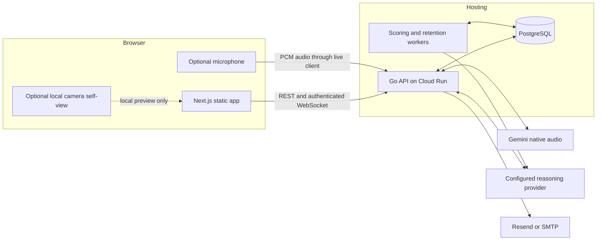
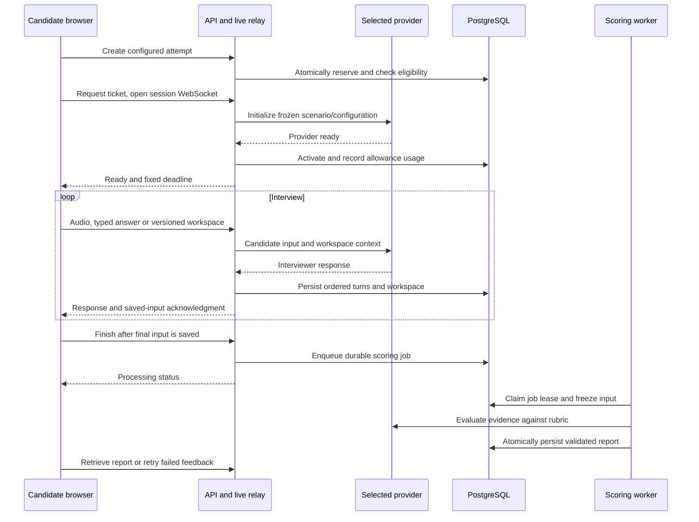

# Architecture — mockinterview.live

The application is a Next.js static web export and a Go API backed by PostgreSQL.
Feature packages own their handlers and small repository interfaces; the API
wires them together in `api/cmd/mockinterview/app.go`. This describes the current
source implementation. See [release validation](RELEASE-VALIDATION-2026-09-09.md)
for checks actually completed and the status of the hosted release.

## System overview

The browser calls the application API; provider requests and personal-key
decryption happen on the server. Gemini supplies native voice. Text interviews
and scoring use the selected reasoning provider. Personal-key sessions retain
that provider and model for feedback, without a platform-funded fallback.
Development supports a labelled deterministic text demo without a provider key;
production rejects demo mode and unlimited local usage.

Camera self-view stays local. The current UI does not perform gaze, posture or
appearance analysis, and appearance is excluded from assessment. The interviewer
portraits are original SVG artwork with audio-driven animation and reduced-motion
support, not a real person or a photoreal video service.

## Backend module map

Paths below are relative to `api/internal/` unless stated otherwise.

| Package | Responsibility |
|---|---|
| `config` | Environment loading, provider settings, production validation and hosted admission settings |
| `auth` | Password authentication, JWT/token-version revocation, verification/recovery actions, mail and WebSocket tickets |
| `store` | PostgreSQL queries, embedded migrations, transactions, leases, usage ledger, scoring jobs, export and retention |
| `store/memstore` | Repository implementation for deterministic tests |
| `corpus` | Scenario/format validation, session configuration and candidate-safe catalog projections |
| `pack` | Multi-round packs, scenario selection and progress |
| `persona` | Voice, face, personality, delivery and language catalogs |
| `interview` | Reservation/admission, session lifecycle, workspace/transcript access, credentials, reports and scoring worker |
| `live` | Director/pacing policy, browser relay, native Gemini transport, acknowledged input and reconnect recovery |
| `llm` | Reasoning adapters, deterministic demo and personal-key encryption helpers |
| `scoring` | Canonical rubric weights, evidence validation, not-assessed dimensions and learning exercises |
| `profile` | Interviewer settings, profile, account export/deletion and voice preview |
| `resume` | Resume extraction, review and matching |
| `feedback` | Product/interviewer feedback, optional consented context and administrator triage |
| `tts`, `i18n` | Voice previews and application-string translation |
| `httpx` | HTTP errors, bounded JSON decoding, safe logging and shared middleware |

Repository changes require both PostgreSQL and memory-store implementations and
updates to the consuming feature interface and `store.Datastore`. Memory tests
cover deterministic behavior; concurrency and durable recovery require the real
PostgreSQL integration tests using an isolated `TEST_DATABASE_URL`.

Administration uses the stored user role, not an email allowlist. The operator
command `api/cmd/admin` grants the role to an explicitly selected, verified user
UUID and revokes earlier login tokens. Verification/recovery actions are
single-use and stored as hashes. Production requires configured mail delivery.

## Interview lifecycle

Hosted admission allows one platform-funded start per rolling seven days and
one total start per rolling 24 hours, including personal-key starts. A separate
global budget limits platform-funded starts. Reservations and failures before
provider readiness do not consume an allowance. Resuming or retrying a report
does not create another start. Local unlimited mode disables hosted admission
limits; provider charges still apply.

Session records freeze the scenario, resolved format, configuration, provider/model
and duration. The server deadline survives reconnects. Database leases fence
competing live connections; transcript sequence numbers and event IDs support
ordered recovery and duplicate-input rejection. Workspace revisions reject
conflicting saves instead of silently overwriting newer work.

Finishing is asynchronous and idempotent. A worker claims a durable job with a
lease, retains scoring input across retries and validates evidence before
committing the report. An expired lease can be reclaimed after restart; stale
workers cannot overwrite a later attempt. Production must allocate CPU outside
requests and keep a minimum instance for these in-process workers.

The director uses authored facts and conditional probes, format stages, target
level, challenge and simulation/coaching settings. Code and SQL workspaces provide
text for review; they do not execute code. Scoring accepts known rubric dimensions
and exact candidate-evidence quotations, with an explicit 512 KiB evidence limit.
These safeguards do not establish practitioner calibration or hiring validity;
content and feedback remain community previews.

## Frontend module map

Paths below are relative to `web/`.

| Location | Responsibility |
|---|---|
| `lib/features/` | Feature-owned API types, HTTP operations and mock behavior |
| `lib/api.ts`, `lib/http.ts` | API composition, authentication transport and recoverable network errors |
| `lib/live.ts` | WebSocket, media capture/playback, acknowledgment and bounded reconnect |
| `lib/setupDraft.ts` | Safe setup choices preserved through authentication, without keys |
| `lib/workspaceSave.ts` | Workspace save sequencing and conflict handling |
| `components/AppShell.tsx` | Navigation, account controls and feedback entry |
| `components/studio/DeviceCheck.tsx` | Text/voice choice and optional device checks |
| `components/studio/Avatar3D.tsx` | Alex, Jordan and Sam SVG portraits and playback animation |
| `components/studio/Workspace.tsx` | Excalidraw, Monaco and accessible written alternatives |
| `components/studio/Webcam.tsx` | Local camera self-view and media cleanup |
| `app/*/page.tsx` | Catalog, setup, interview, report, history, account and public information pages |
| `app/globals.css`, `components/ui.tsx` | Shared presentation and interface controls |
| `scripts/vendor-assets.mjs` | Local Monaco assets and Excalidraw fonts for development and static builds |

Provider keys stay in transient UI state until sent to the API; they are not
stored in browser local storage. Server-side session credentials are encrypted
with the configured 32-byte key and expire after three hours. A feedback retry
can request re-entry after expiry. Consult
[the artwork record](../web/components/studio/ARTWORK.md) before adding portraits;
there is no legacy third-party avatar registry to extend.

## Data and retention

PostgreSQL stores accounts, resumes/reviews, configuration, sessions, ordered
transcripts, workspace/canvas snapshots, scores/reports, feedback, scoring jobs,
short-lived credentials and auth actions. Legacy behavioral tables remain for
historical compatibility; the current UI does not collect camera-derived signals.

Account export includes saved user records and excludes credentials, auth actions,
private interviewer references and internal usage/lease fields. Deletion removes
account-linked records. The independent usage ledger contains an HMAC of verified
email and remains for the rolling seven-day window so deletion cannot reset
hosted eligibility. Database backups follow their separate retention policy.

Maintenance runs on startup and hourly. It removes expired auth actions and
personal keys, credentials for completed/abandoned/failed sessions, usage entries
older than seven days and legacy raw behavioral samples older than thirty days;
it also abandons expired reservations. Completed history remains until the user
deletes the interview or account.

## Deployment and change guide

Cloud Build creates the API image from committed source. Cloud Run stages an
immutable candidate before explicit traffic promotion. Firebase Hosting serves a
static export built and previewed from committed source, then promotes that same
version. The app uses its own database/login on a shared Cloud SQL instance,
with app-scoped secrets and a dedicated runtime identity.

Use [the release runbook](RELEASE-RUNBOOK.md) for validation, mail, monitoring,
promotion and rollback. New database setup also requires
[database role hardening](DATABASE-ROLE-HARDENING.md). `/health` checks liveness;
`/ready` checks database access and model configuration, not provider or mail
availability.

For content changes, follow [the corpus contract](CORPUS.md) and
[contribution guide](../CONTRIBUTING.md). Director behavior lives in
`api/internal/live/director.go` and `policy.go`, native transport in
`gemini_socket.go` and `relay.go`, assessment in `api/internal/scoring`, and durable
lifecycle in `api/internal/interview` and `store`. Update portraits in
`web/components/studio/Avatar3D.tsx` alongside `api/internal/persona/faces.go`.
