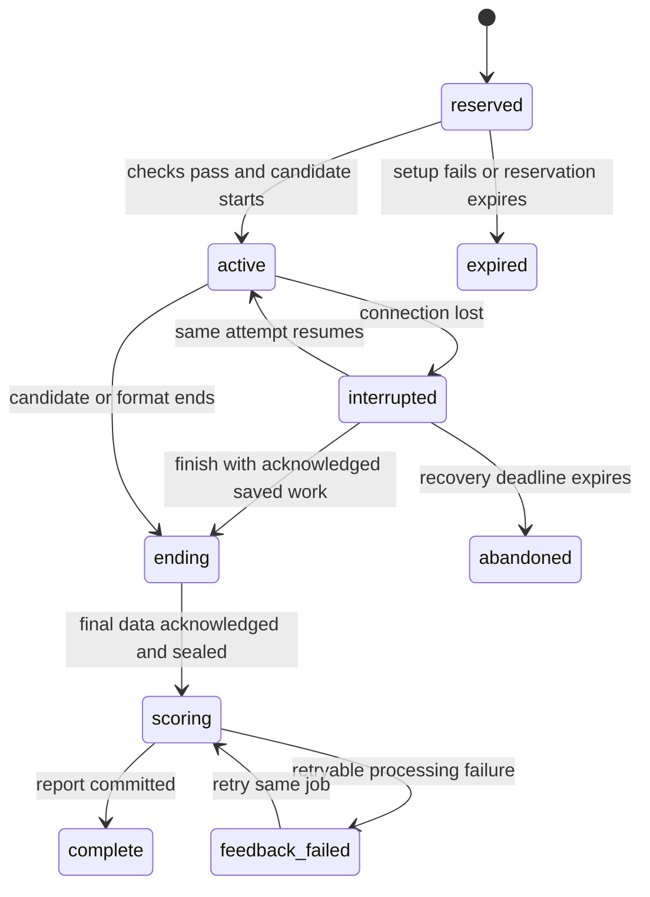

# Mockinterview improvement plan

> **Historical proposal.** Implementation has since progressed beyond this plan. Its future-tense tasks and baseline counts are preserved as design context. Read [implementation validation](RELEASE-VALIDATION-2026-09-09.md) and the [release runbook](RELEASE-RUNBOOK.md) for current evidence and release work.

Prepared 2026-09-09. Status: proposal based on repository review, Obsidian context, local checks, browser inspection, and read-only deployment verification. Implementation and deployment are future work.

Companion documents: [evidence and audit](AUDIT-2026-09-09.md), [verified deployment and update procedure](DEPLOYMENT-UPDATE-PLAN.md), [launch gates and additional concepts](LAUNCH-READINESS.md).

## Recommendation

Keep the Go/Postgres modular monolith and Next.js frontend. Redesign the user journey around choosing a practice goal, entering a dependable interview room, and leaving with useful evidence-based feedback. Strengthen the interview engine and contribution contracts underneath it. A wholesale backend rewrite would discard useful work without solving the identified reliability problems.

The core promise should be: **Practice a realistic interview for your role, understand what to improve, and help the community add better interviews.**

Follow-up launch review confirmed the GitHub repository is currently private. Public source access, contribution settings, asset provenance and a verified anonymous clone are launch gates, alongside the app improvements. See [LAUNCH-READINESS.md](LAUNCH-READINESS.md) for the additional access, privacy, operations and usability requirements.

The project already has 137 scenarios, 23 domains, 11 professions, four workspaces/modalities, six packs, persistent reports/history, product feedback, swappable reasoning providers and animated avatars. The largest gaps are incomplete recovery and scoring guarantees, shallow or unused scenario instructions, an overcomplicated setup flow, and no per-user model/key support. The current hosted policy is two starts per day, not the requested weekly policy.

Preserve the existing opt-in camera analysis and non-scored presence notes, refusal to invent assessments from insufficient evidence, deterministic local stub, corpus rubrics, API ownership checks, and reusable workspace/provider modules.

## Product decisions for the first release

| Area | Proposed decision |
|---|---|
| Canonical domain | Keep the currently verified `.live` deployment until the owner resolves the `.io` naming difference. Do not couple a DNS migration to the reliability release. |
| Default experience | Professional, neutral interviewer; format-appropriate duration and medium challenge. Minimal required setup. |
| Hosted allowance | One platform-funded interview per rolling seven days. |
| Own-key allowance | One interview per rolling 24 hours on the hosted site; one total hosted start per 24 hours across funding modes, so switching modes cannot double the daily allowance. |
| Local use | Documented self-host configuration with no product-imposed practice quota; provider limits and charges still apply. |
| Unit of an interview | One clearly named round/attempt with its own duration. A pack is a learning plan containing rounds, not a quota bypass. Show the cost before starting each round. |
| Difficulty | Target seniority and challenge are distinct from interviewer demeanor. Choose target level in setup; put challenge/style customization under optional settings. |
| Avatar | Improve the existing local glTF renderer and playback synchronization first; use a small, consistent, licensed character set. |
| Quality bar | No known critical/high-priority defects in supported interview paths; deterministic regression gates plus bounded live evaluations and rollout monitoring. No claim of guaranteed zero bugs. |

Rolling windows and the combined daily ceiling are proposed policy interpretations, not existing functionality. Return the exact next eligible time in the user's timezone; do not require users to calculate the window.

## 1. A simpler UX from discovery to reflection

### Discovery and navigation

Replace the system-design-only marketing with a public, searchable catalog covering the real professions and interview formats. Let visitors inspect a sample brief, expected duration, target level, workspace and what is assessed before signing in. Explain the weekly allowance and open-source/local option plainly.

Use **Practice, History, Contribute** as the primary navigation, with account, model connections and preferences in a compact settings menu. Resume review can remain an optional preparation tool inside Practice. Packs become curated learning paths in the catalog, rather than another competing start flow.

Remove the mandatory profession gate and the empty-dashboard detour. Ask for a role when it helps recommend interviews, retain the answer, and always provide Browse all. Replace daily streak pressure with comparable skill progress and a useful next exercise; weekly hosted access should not imply the user ought to interview every day.

### Setup and device check

Use one short setup screen:

1. Role and format, already selected if entered from the catalog.
2. Target level and duration, with sensible format defaults.
3. One primary Continue action leading to a small device/provider check.

Put challenge, interviewer style, appearance/voice, language, optional resume/job description, and funding/model selection in progressive disclosure. Preserve last-used preferences. Short MMI stations should not inherit a resume discussion or a six-minute generic introduction/wrap-up.

Show “Your weekly interview is available” or the exact reset time before requesting permissions. If using a personal key, display the supported mode, model, key status and the daily limit. Verify credentials, model capabilities and allowance before committing an attempt. Camera stays optional and starts off; camera analysis has its own explicit consent, separate from self-view. Include mic level, speaker test, device selection, permission-denied recovery and a clear text option.

### The interview room

Give most of the screen to the candidate's task. Keep the brief visible beside the appropriate workspace: drawing, code, writing, or conversational notes. Put a smaller interviewer portrait in a stable side panel, with captions/transcript available without crowding the workspace. On mobile, use brief/workspace/conversation tabs with persistent meeting controls; do not overlay the camera on working content.

The control bar needs mic mute, camera toggle, captions/text, connection state, remaining time and Finish. Use explicit Listening, Thinking, Speaking, Reconnecting and Saved/Unsaved states. Typed answers need sending/sent/retry status. Transcript scrolling must respect users reading earlier turns. Add accessible labels, focus management, keyboard operation, reduced motion and sufficient contrast.

Reconnect should preserve the current interviewer, question, stage, transcript order, remaining time and exact workspace. Finishing should show “Saving your final answer” before “Preparing feedback,” with a retryable failure state. Users must never have to guess whether their last answer counted.

### Feedback and return visits

The report starts with strengths and two or three specific next steps, each tied to a transcript turn or workspace artifact. Detailed rubric, full transcript, saved work and configuration live in expandable sections. Show unassessed dimensions honestly. Avoid combining unrelated professions or difficulty levels into one readiness score.

History should show active, interrupted, processing, completed, failed and abandoned attempts accurately, with search/filter, pagination, export and per-session deletion. Resume applies only to recoverable sessions; processing sessions open progress, and failed feedback jobs offer retry without creating a new interview. Show the original format/configuration and report versions.

After the report, ask two separate optional questions: “How realistic was the interviewer?” and “How was the product experience?” Add optional question/report-quality tags and comments. Retain the existing in-room Report a problem action with the session/time attached. Reviewing history, reading material and contributing remain available when quota is exhausted.

## 2. Reliable session execution before wider launch

Introduce one server-owned state machine:

Implement:

- A single serialized sender for **each** WebSocket direction. The browser-facing writer is protected today; the upstream Gemini writer also needs protection across audio, section changes and tool responses.
- Explicit provider-ready acknowledgement. Socket-open is not interview-ready. Distinguish terminal key/model errors from transient network errors and honor a bounded reconnect policy.
- A server session clock, deadline, current stage, immutable attempt ID and ordered event sequence. Never restart the clock or transcript sequence on a new connection. Reconcile UI duration options with server limits.
- Durable per-user/per-session leases so duplicate tabs and multiple Cloud Run instances cannot open concurrent model sessions. Use heartbeats, expiry and fencing so an old connection cannot continue writing after a new owner resumes.
- Provider resumption handles and GoAway handling where supported. Keep the existing context compression; it solves a different problem. Google currently documents finite connection lifetimes and session resumption across connections. [Live API session management](https://ai.google.dev/gemini-api/docs/live-api/session-management).
- Acknowledged candidate turns with stable event IDs, duplicate detection and a bounded client outbox. Persist full structured whiteboard scenes, code plus language, and notes with revision numbers. Restore before enabling editor writes; flush debounced saves on end.
- Correct audio cancellation: retain/stop scheduled PCM sources, reset playback clock and avatar state, and stop tracks if a permission request resolves after disposal. Local media permissions must not cause an ended room to restart capture.
- An idempotent ending protocol that drains final turns and artifacts before creating a frozen scoring input. Add a database uniqueness key for one scoring job/input version. Return a processing state and complete reports transactionally.
- Durable scoring retries: use a Postgres job/outbox record plus a protected worker endpoint driven by Cloud Tasks in production; use a local worker in development. Verify the task's OIDC identity, audience and designated service account, or place the worker on a separate private service. Ordinary user authentication must not authorize worker execution. Resolve the sealed job server-side rather than accepting arbitrary scoring inputs. Design at-least-once delivery to be harmless. A detached 90-second request context alone cannot recover from process termination.

Keep session state and jobs in PostgreSQL initially. Add another distributed store only if measured scale warrants it.

## 3. Weekly access, own keys, and self-hosting

### Enforce the policy on the server

Add a usage ledger recording funding source, reservation, activation, release/refund and policy version. Check and reserve under a per-user database lock/transaction. Deny paid starts when quota storage is unavailable. A double click, parallel request or duplicate queue delivery must not create a second attempt or charge.

Reserve briefly during setup; activate/consume once the provider is ready and the candidate explicitly starts. A failed preflight releases the reservation. A confirmed technical failure before substantive participation may refund once under a bounded rule; normal abandonment retains the debit. Reconnection and feedback retries belong to the original attempt. Deleting a session must not delete its usage debit. Display the result of every policy transition in the UI.

Define account deletion/recreation explicitly: the same verified identity must not gain another funded allowance by deleting and recreating its account during an active window. Retain only a minimal pseudonymous eligibility record until that window expires, document this bounded retention, and remove practice records through the normal deletion flow. Test this separately from session deletion; do not call a keyed identity hash anonymous data.

Protect funded access with verified account identity and explicit stored admin roles. Remove public hardcoded admin-email defaults. Admin/dev exceptions must be deliberate, audited settings; user-submitted email or config must never grant a role or an unlimited quota.

Add `GET /usage` returning policy, funded availability, total daily eligibility, next eligible timestamps, current reservation/session and supported alternatives. Add separate ceilings for key validation, voice previews, resume review, feedback scoring retries, total provider usage and active-session duration so the interview quota is not the only cost control.

### Personal provider/model/key support

The app currently selects one reasoning client at process startup and always uses the server Gemini key for native voice. Add a per-session provider resolver and a capability registry for conversation, structured scoring, realtime speech, transcription and synthesis.

The simple UI is Provider → API key → optional Model. Validate supported models and capabilities and offer an appropriate default. Start with Gemini BYOK for the existing full voice path; support other existing adapters for an explicitly labeled text interview, then add tested speech pipelines or native realtime adapters. A reasoning key alone must not silently trigger platform-funded Gemini speech. Provider usage charges belong to the key owner; the hosted daily cap still applies.

For provider-neutral voice, define a speech-input → turn-controller → selected-model → speech-output adapter. Test its latency and interruption behavior before marking it equivalent to the native voice experience. Unsupported combinations should offer text or an explicit supported voice connection, rather than fail after the interview starts.

Default to session-only credentials. Keep raw keys out of localStorage, URLs, normal profile/session JSON, prompts, telemetry and feedback. Transmit only over TLS to a dedicated endpoint; use a short-lived encrypted credential record outside interview data so another instance can resume and the scoring worker can finish. Bind it to the user and attempt, enforce expiry, decrypt only in authorized provider calls, and delete after completion/expiry. If it expires before recovery, ask for re-entry without losing the interview. Retain only provider/model metadata and a masked label.

Allow hosted connections only to approved upstream destinations; make arbitrary OpenAI-compatible base URLs a self-host feature initially. Provide Forget key and cancel controls, redact provider errors, and test credential isolation between simultaneous users. Encrypting stored credentials does not justify logging them.

When blocked, show the exact reset time plus the available next step. After the user's daily hosted allowance, show **Run locally for more practice**, linked to the actual repository and working instructions. Do not hide their existing reports behind the limit.

## 4. Realistic, configurable interviewer behavior

Separate target level, challenge and demeanor:

| Control | What changes |
|---|---|
| Target level | Expected independence, scope, judgment and rubric anchors |
| Challenge | Ambiguity, constraints, data completeness, depth and follow-up complexity |
| Interviewer style | Warmth, concision, waiting and respectful probing; it does not alter factual correctness or secretly grade more harshly |
| Practice mode | Default simulation with bounded neutral clarification; optional coaching mode explicitly permits and records hints |

Drive the interview from a versioned format and scenario. Compose domain instructions **with** author notes. Give the engine private scenario facts, conditional reveal rules, follow-up triggers, acceptable alternatives, misconceptions and stop conditions. Preserve those facts throughout reconnects and context compression.

Use explicit actions such as ask, clarify, probe, reveal requested fact, allow thinking time, transition and wrap up. The controller validates stage, elapsed time, coverage, permitted assistance and previously asked questions; the model phrases the selected action naturally. Avoid hardcoded question recitation and also avoid giving the model unconstrained control over timing or grading.

Observable behavior should include one question at a time, appropriate silence, listening through corrections, relevant follow-ups, acknowledgment without constant praise, no solution disclosure in simulation mode, no repeated greeting after reconnect, and a concise format-appropriate close. Questions from the candidate must be handled naturally. Respect communication style and accessibility needs; camera presence, accent and appearance must not affect technical grades.

For example, a consulting interviewer should reveal a known margin figure when asked, then probe the candidate's interpretation; it should not invent a new number. An eight-minute MMI should spend most of its time in the scenario. A senior design interview should probe trade-offs and failure modes; entry-level practice should assess sound fundamentals without demanding staff-level breadth.

Create one coherent interviewer identity joining name, face, voice and role. The current live introduction uses the voice label rather than the selected person's name. Keep clear AI simulation labeling and remove instructions to deny being AI.

### Scoring

Use the same frozen scenario, target level, difficulty and rubric version as the interview. Evaluate the whole interview through bounded evidence segments, not just the first transcript prefix. Preserve later corrections and improvements. Link evidence to stable turn/artifact IDs.

Validate exact rubric dimensions, unique keys, canonical weights, numeric bounds and evidence references. Treat missing evidence as unassessed. Separate the observed evidence from generated coaching. Track disagreement between reviewers/evaluators and calibrate on authored strong, mixed, weak and incomplete attempts. Correct the pack-readiness divisor and compare progress only across compatible rubric versions and levels.

## 5. A better interviewer face

The project already ships glTF models and morph-target animation. Improve that asset and rendering pipeline rather than adding a mandatory per-minute video service to the weekly free experience.

- Use a small, visually consistent set of professional, clearly synthetic characters with documented redistribution rights and real thumbnails. Asset quality must be reviewed visually, not inferred from a “realistic” filename.
- Improve materials, skin/eye shading, lighting and stable head-and-shoulders framing. Keep the portrait modestly sized so candidates can focus on the task.
- Drive lips from actual audio playback timing and, where available, phoneme/viseme alignment. Current packet-arrival amplitude is ahead of queued sound and is only a rough proxy for mouth shape.
- Tie restrained gaze, nods and expressions to speaking/listening/considering actions. Stop animation on interruption and keep the face consistent with the preview and voice identity.
- Provide a polished static portrait for low-power, reduced-motion or WebGL failure states; the interview must remain usable without 3D.
- Evaluate a streamed photoreal avatar as an optional later driver only after comparing visible quality, latency, licensing, privacy and cost. It should not delay reliable local rendering.

Acceptance: no offscreen/clipped heads at supported widths, no mouth movement after interruption, synchronized speech within the measured target, correct disposal, and stable performance through a full interview on ordinary laptop/mobile hardware. Begin with targets of under 200 ms visible lip/audio offset and at least 30 FPS on the chosen reference device, then validate these rather than claiming they already hold.

## 6. More formats through a contributor-friendly contract

Distinguish **profession** (who is practicing), **format** (how the interview works), **scenario** (the particular task), **workspace** (the tool), and **pack** (a sequence of rounds). Adding question JSON alone does not create a new interview format.

Introduce versioned JSON schemas and a backward-compatible adapter:

| Artifact | Required contents |
|---|---|
| Format | Stable ID/version, permitted workspaces, interviewer role, timed stages/transitions, wait/interrupt/hint policy, ending rules |
| Scenario | Format reference, professions/domain, public brief, private facts/reveal rules, triggered probes, acceptable approaches, calibrated rubric, challenge variants, conversation fixtures |
| Pack | Versioned selectors, actual round duration, level policy, repeat avoidance/selection seed, provenance and review date |
| Shared metadata | Author, source, license, reviewer/date, content revision and compatible engine version |

Snapshot these versions into attempts so an edited contribution cannot retroactively change an old report. Private interviewer facts stay off candidate-facing APIs. Community contributions should not require a paid key for validation or preview.

### Expansion sequence

First make seven reference experiences excellent: coding, system design, behavioral, interviewer-led consulting, timed MMI, sales roleplay and portfolio review. Preserve real domain differences and test every format at more than one level.

Then expand in coherent batches:

| Batch | Additions | Workspace/engine needs |
|---|---|---|
| Technical practical rounds | Debugging/pair programming, SQL/data analysis, SRE incident response, security threat modeling, engineering leadership | Code/log/dataset artifacts, staged evidence, technical roleplay |
| Product and business | Recruiter screening, UX portfolio/critique, sales discovery/objection handling, customer success, marketing case, HR/recruiting | Roleplay counterpart, portfolio/presentation artifacts, format-specific scoring |
| Professional depth | More nursing prioritization, finance modeling, consulting exhibits, mechanical/electrical/civil reasoning, education scenarios | Reviewed facts, exhibits and specialized rubrics; subject-matter review |
| Later interactions | Panel interviews, case presentations, multi-round loops | Explicit speaker roles, transitions, shared context and transparent quota accounting |

Promote UX/design, sales, marketing, HR/recruiting and education from mislabeled one-offs into genuine role groups with several reviewed scenarios. Prefer 5–10 distinct scenarios and at least two calibrated challenge levels for each newly promoted format over a large count of near-duplicates. Start by filling entry/junior coverage: the current corpus is overwhelmingly mid/senior.

Coding execution, SQL evaluation and file analysis need an isolated execution boundary with time/memory limits before accepting arbitrary candidate code; they must not run inside the API process or the shared production database. Launch non-executing review formats honestly while that workspace capability is built.

Company packs should describe approximate practice styles with sources and review dates; do not promise an exact current hiring process. Rotate scenarios and avoid immediate repeats.

### Contribution guidance to ship

Add prominent README and in-product Contribute links with three routes: **add a scenario**, **add a format**, **fix the experience**. Extend CONTRIBUTING and docs/CORPUS with a copyable valid example that matches the actual schema, including required `areas` during migration.

Provide proposed commands `make new-scenario`, `make new-format`, `make validate-content` and `make preview-format` (not implemented today). The scaffolder should generate metadata, a rubric, behavior rules and fixtures. Strict validation should catch unknown fields, broken references, duplicate rubric keys, invalid weights, missing scenario facts, mismatched filename/ID and incomplete level variants.

Each contribution supplies concise fixtures for clarification, a strong response, misconception, silence, correction and wrap-up. CI asserts facts, stage transitions, assistance policy and evidence quality instead of exact generated wording. Separate schema/runtime review from subject-matter review. Use issue/PR templates, contributor credits, good-first-issue labels and reviewer ownership. Public issues must not contain user transcripts or API keys.

## 7. History and the product-improvement loop

Persist transcript, full workspace, actual duration/stages, rubric evidence, report, selected model/provider, funding source (never key), and versioned format/prompt/configuration. Use cursor pagination and UTC timestamps with explicit offsets. Keep the user's private practice record private; exporting or sharing should be explicit.

Extend feedback with typed targets: interviewer realism, question accuracy, assessment usefulness and product problem. Add optional session/turn/stage references, version metadata and lightweight tags such as talked over me, repeated question, incorrect fact, lost work or unhelpful feedback. The user can submit a rating without writing a paragraph.

The maintainer view needs new/triaged/in-progress/resolved status, severity, grouping by format and release, and aggregate trends. Verify session ownership on submission. Attach technical diagnostics by default only from an allowlist; transcript excerpts require an explicit optional selection and server-side redaction. Do not automatically turn private feedback into public GitHub issues.

Implement the existing but unscheduled raw-behavior purge and verify the retention job runs. Document what remains in history, how exports/deletion work, and how anonymous aggregate product metrics are separated from practice records. Do not upload raw camera video or microphone recordings by default. Keep camera observations optional and non-scored.

Measure successful start/finish, reconnect recovery, feedback readiness/failure, save reliability, interruption latency, provider spend and user-rated realism. Use product events without raw interview content. Segment by format/model/release to identify regressions and create synthetic regression fixtures from recurring bug patterns with appropriate consent.

## 8. A README that makes local use a real escape hatch

Document a complete fresh-clone path: repository URL, supported Go/Node versions, dependency installation, `.env.example`, Postgres readiness, migrations, start commands and local URLs. State clearly what deterministic stub mode can demonstrate and what needs a live provider key.

Provide three paths:

- **Try locally without a key:** working UI/API fixture mode, explicitly marked as simulated.
- **Practice with your own model:** configure reasoning and, where needed, speech credentials; select local unlimited policy; run a real interview and saved report.
- **Self-host:** complete API/web/Postgres Compose setup, production auth settings, TLS/API origin, persistent volumes, backups, upgrades, migration compatibility and provider costs.

Fix missing frontend install instructions, the fixed two-second database wait, the nonexistent `-seed` target, the misleading `make test` description, and the mismatch between mock-only CI and production configuration. Keep provider/model examples capability-based and maintained; avoid implying every reasoning key enables voice.

Add a fresh-clone CI smoke check. Stabilize the lockfile so CI uses reproducible installation. Do not require proprietary hosted services merely to contribute a scenario. Preserve the repository's existing AGPL license and add asset/source attribution where needed.

## Delivery plan and release gates

Ship focused, reviewable changes. Parallelize UX design and content authoring with backend stabilization, but integrate against agreed session/provider contracts.

| Order | Deliverable | Main code areas | Completion gate |
|---|---|---|---|
| 1 | Transport and authorization fixes | `internal/live`, `internal/auth`, `internal/config`, `web/lib/live.ts` | Both socket directions serialized; interruptions stop audio; late mic permission cleaned up; provider errors surfaced; admin privilege cannot come from a signup email |
| 2 | Durable attempt, artifacts and scoring | `internal/interview`, `internal/store`, migrations, `Workspace`, room/report clients | Refresh/reconnect restores exact work/time/order; final answer reaches one durable scoring job; DB/provider failure is visible and recoverable |
| 3 | Atomic quotas and BYOK | New usage/provider/credential services and client slices | One funded start/7d and one hosted start/24h; concurrent requests cannot bypass; technical-start failures recover; credentials isolated/redacted; capability mismatch caught before start |
| 4 | Discovery/setup/lobby/room redesign | App shell, catalog, setup, room, accessibility | First-time and returning-user journeys pass on desktop/mobile; one clear start action; no required camera; reliable text fallback |
| 5 | Format-driven realism and calibrated scoring | Corpus schemas, director, scoring, packs | Seven reference formats pass conversation fixtures; notes/facts/triggers used; short-format pacing correct; no solution leakage; exact rubric output validated |
| 6 | Avatar and feedback/history finish | Avatar renderer/assets, history/report, feedback admin | Playback-aligned face, low-power fallback; durable searchable history; optional feedback categories and controlled diagnostic sharing |
| 7 | Contributor tooling and new content batches | Schemas/scaffolder, README/CONTRIBUTING, corpus, CI | A new contributor can run locally and add a validated scenario without a paid key; new formats have reviewed scenarios and fixtures |
| 8 | Staging, controlled deployment and documentation | `deploy/`, CI, operations, telemetry | Isolated end-to-end evaluation, verified backup/migrations, recorded rollback targets, gradual release and updated runbook |

Suggested first implementation slice: complete one neutral behavioral interview from public discovery through preflight, bounded quota, recoverable conversation, final-save acknowledgement, durable feedback and history. Then run the same lifecycle through coding and whiteboard so those artifacts are proven before broad rollout.

### Required verification

- **Concurrency/data:** real PostgreSQL transactions; parallel starts; duplicate finish/retries; database failure during save/report; lease expiry/takeover; reconnect on another instance; migration from existing data; old reports unchanged.
- **Browser/media:** Chromium, Firefox and Safari/WebKit-supported paths; permission denial and late grant; missing devices; mute/camera behavior; interrupted speech; text while offline; refresh/back navigation; final save; reduced motion; keyboard-only operation; narrow screens.
- **Conversation:** synthetic strong/vague/wrong/silent/correcting candidates for each reference format and supported level; no repeated questions/greetings; consistent private facts; purposeful follow-ups; format-specific timing; multilingual voice/text behavior where advertised.
- **Assessment:** full late-stage evidence, unassessed behavior, exact rubric dimensions/weights, repeatable scoring jobs, known excellent/partial/poor fixtures, calibration against reviewer judgments.
- **Privacy/abuse:** ownership checks, forged admin email, key isolation/redaction, safe upstream destinations, quota accounting across funding modes, session deletion, feedback context permissions and retention execution.
- **Release:** production build with mock mode off; bounded real-provider tests; a full-duration reconnecting interview; rollback rehearsal; health/readiness/version visibility.

Every acknowledged artifact write must be durably recoverable. Unacknowledged work stays visibly pending/retryable. After baseline measurement, target at least 99% save requests acknowledged within the chosen save-latency budget and at least 99% eligible finished attempts producing a completed report; report failures remain failures in that metric. Separately require every failed job to expose its state and a recovery path, and no duplicated quota debits/jobs in adversarial tests. Establish useful latency objectives from the measured voice path (initial targets: p95 reply audio within 2.5 seconds of turn-end and feedback within 60 seconds), with separate provider-error reporting. These are proposed engineering targets, not current measurements or service guarantees.

This plan deliberately makes reliability testable. Current green unit tests alone do not establish realistic conversations, correct long-session recovery, or a bug-free launch.
