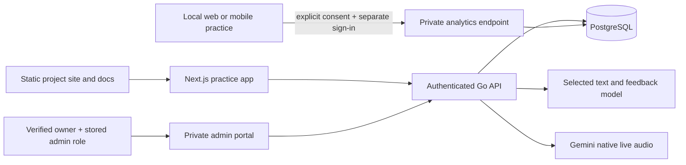

# Open source practice: design and operations

This document describes the current source update, not a deployment record.
[Architecture](ARCHITECTURE.md) describes the full interview engine;
[the changelog](../CHANGELOG.md) distinguishes source changes from verified releases.

## System design



The project site and application share a static Next.js export. Public pages do
not require an account; practice, personal history and participation use the API's
existing authentication. The API remains the authorization boundary. Hiding a
navigation link never grants or revokes access.

Production uses PostgreSQL and real model providers. A development-only
`LOCAL_MEMORY=true` runtime implements the same store contract in memory and
binds to loopback; accounts and results disappear when the process exits. The
cross-platform launcher makes this temporary mode explicit. Native PostgreSQL and
Docker provide persistent local alternatives. Neither is a signed desktop app.

## Low-level feature boundaries

| Module | Responsibility |
|---|---|
| `api/internal/community` | Bounded beta/template/analytics requests; verification; consent and admin authorization |
| `api/internal/store/community.go` | Durable participation queries, transactional approval, analytics upsert and deletion |
| `api/internal/store/memstore` | Equivalent development/test store behavior |
| `api/internal/interview/custom.go` | Validate a free-text brief, request and validate an AI interview plan, snapshot private practice |
| `api/internal/interview` and `store` | Admission, selected credentials/model, lifecycle, reports, runtime metrics and durable jobs |
| `web/components/project` | Project pages, accessible OS setup tabs and community navigation |
| `web/lib/features/community.ts` | Typed participation and owner-portal API calls |
| `web/app/beta`, `requests`, `admin` | Feedback commitment/application, private template request, owner review |
| `scripts/local.mjs` | Prerequisite checks, dependency install, isolated API build, loopback processes and cleanup |

The API validates user input before persistence. Model-generated plans are also
untrusted: stage/rubric counts, weights, format structure and content bounds are
checked before creating an interview. A malformed provider response is an error,
not a silently invented assessment. Private custom briefs never enter the shared
public template catalog.

Custom creation first acquires an atomic `preparing` reservation, before making
the billable planner call. This reservation counts against concurrency and the
funded budget but cannot start a socket or scoring job. A validated plan atomically
moves it to `reserved`; provider readiness later activates normal usage. Planning
failures expire the reservation, remove credentials and record only the safe
`planning_failed`/`preparation` event fields. They do not consume an interview
allowance. Stale preparation is abandoned by maintenance.

### Custom interview input

A create-session request can select a template or supply `custom`, not both:

```json
{
  "minutes": 20,
  "custom": {
    "profession": "Senior engineering manager",
    "goal": "Explain how I lead a team through a difficult delivery decision",
    "level": "Senior, moving toward director",
    "questions": "How do you resolve disagreements about scope?\nHow do you mentor new leads?",
    "structure": "Brief introduction, two experience questions with follow-ups, then reflection"
  }
}
```

Other existing session options, consent and funding fields still apply. Profession
(up to 160 characters), goal (2,000) and level (120) are required text. Questions
(12,000) and structure (4,000) are optional text. The selected model prepares three
to six timed conversation stages and three to six observable rubric dimensions.
The generated format, original brief and selected model are frozen into the
session. The director receives them to run the interview; grading uses the same
snapshot and actual candidate evidence. Text/code can be discussed, but custom
practice does not execute code or introduce unavailable external tools.

### Access policy

| Funding/access | Interview allowance |
|---|---|
| Standard hosted, project-funded | One activated start per rolling 24 hours; global funded budget still applies |
| Validated personal API key | No daily interview count limit; provider charges and limits apply |
| Approved beta tester | Unlimited starts; feedback commitment recorded in application |
| Local development | Unlimited practice; provider charges still apply when real keys are used |

Email verification, current policies, one active session, duration limits and
security throttles still apply where appropriate. Reservations or failed provider
readiness do not spend an interview start. Resumes and report retries keep the
same attempt. A funded text/feedback default of Gemini 2.5 Flash is intentional;
native voice uses its separately configured Gemini audio model. Personal provider
keys are validated before use and the model choice is retained for feedback.

## Database schema

Migrations `0013_runtime_metrics.sql` and `0014_community.sql` are additive.
The first adds a nonnegative `sessions.runtime_error_count`, backfilled from
persisted interview/scoring failure events. The second adds participation tables.
Existing sessions, reports, usage and feedback remain the source of truth for
hosted practice. The new tables store participation and explicitly shared local
results:

| Table | Key fields and constraints | Purpose |
|---|---|---|
| `beta_applications` | UUID primary key; unique `user_id` FK; bounded motivation; required true feedback commitment; commitment timestamp; pending/approved/rejected; reviewer and review time | One application per account, explicit commitment and review trail |
| `template_requests` | UUID primary key; user FK; bounded profession, goal, free-text level and description; new/planned/shipped/closed; reviewer/time; recent index | Private product requests without adding unreviewed catalog entries |
| `shared_interview_results` | UUID primary key; user FK; unique `(user_id, source, client_session_id)`; web/local/mobile; consent version/time; bounded JSON payload; created/updated times; recent index | Idempotent consented result snapshots, separate from hosted session records |

Each account FK cascades on account deletion. Reviewer FKs become null when a
reviewer is deleted. Export includes the user's participation and shared records;
credentials and internal authorization material are excluded. Users can delete
shared analytics independently of their normal history. Existing backup retention
remains a separate operator concern.

### Transaction and identity guarantees

Beta approval locks the application and applicant, verifies the stored commitment
and verified email, then grants `tester_emails` membership and updates the review
record in the same transaction. Rejection removes that membership atomically.
Tester membership is not an admin role. Reapplying after rejection returns the
application to pending; editing a pending/approved application does not grant
additional access.

The server derives `user_id` from authentication, never from an upload's asserted
owner. The unique analytics key makes retries replace one account's own snapshot
without duplicating it or touching another account. Consent version/timestamp are
recorded with the write. PostgreSQL constraints enforce identity and state
invariants independently of application validation.

## API contracts

Paths below start with `/api/v1`. All participation and owner routes require the
existing bearer authentication; writes additionally require verified email where
specified. Ordinary account authorization applies to account export/deletion.

| Method/path | Contract |
|---|---|
| `GET /community/beta` | Own application and current unlimited tester status |
| `POST /community/beta` | Verified user; `{motivation, feedback_commitment:true}` |
| `POST /community/templates` | Verified user; `{profession, goal, level, description}` |
| `POST /community/analytics` | Verified user; explicit consent/version, client ID/source, allowlisted metrics and optional report/feedback |
| `DELETE /community/analytics` | Delete the authenticated user's shared uploads |
| `GET /admin/community` | Owner only; recent applications, requests, shared results and feedback |
| `PATCH /admin/community/beta/{id}` | Owner only; approved or rejected |
| `PATCH /admin/community/templates/{id}` | Owner only; new, planned, shipped or closed |
| `GET /admin/interview-feedback/metrics` | Owner only; versioned feedback aggregate and lifecycle outcomes |
| `GET /admin/interview-feedback/comments` | Owner only; paginated private suggestions |

The initial participation overview is bounded to the most recent 200 records per
category; it is not a complete analytics warehouse or public community feed.
Existing feedback endpoints keep their own pagination and review controls.

## Feedback, metrics and consent

Ordinary hosted history is stored by the serving API so that users can resume,
review and export their work. Core operational records distinguish reserved,
active, complete, failed, interrupted and abandoned work as supported by the
lifecycle. Authenticated session responses include
`runtime_metrics: {error_count, turn_count, duration_seconds}`. Error count
measures persisted failure episodes, including recovered errors, rather than
guessing from final status. Turn count comes from persisted transcript rows;
elapsed time is bounded by the session deadline. The durable error counter
survives cleanup of raw diagnostic events. Preparation, live and scoring errors
retain safe codes/stages without copying model responses, credentials or private
transcript text into diagnostics. Runtime telemetry and the product check-in are
separate from the AI assessment. See [metric definitions](FEEDBACK-METRICS.md) for denominators,
response versions, non-response and score interpretation. Do not treat a missing
survey answer as a favorable experience or a failed assessment as a zero score.

Optional central sharing from local web/mobile apps requires an explicitly
configured HTTPS API, a separate sign-in, and the default-off **Share analytics**
choice. User-facing copy stays short; details belong in Privacy. Remote sharing credentials stay in memory. Mobile consent resets when the app
closes; web consent is stored per local account in that browser until disabled.
Local web clients must reconnect their remote account after the page closes. The client
sends best-effort uploads and catches network failures so local practice continues.
There is no guaranteed upload queue, backup or cross-device history sync.

The analytics schema accepts terminal status (`complete`, `failed`, `interrupted`,
`abandoned`), provider/model, duration, turn/error counts, optional score, feedback,
and a bounded report containing coaching and rubric results. It rejects unknown
fields, invalid ranges and unsupported consent versions. It has no transcript,
audio/video recording, resume or credential field. Credential-like text is
redacted defensively, but users should still avoid secrets in feedback. Shared
records stay behind owner authorization and never become testimonials. A public
story needs separate publication permission.

## Owner bootstrap and deployment

The project owner is `makinenitejovardhan@gmail.com`. Matching that address is
necessary but never sufficient: every admin request also checks a verified
mailbox and the current persisted `admin` role. A forged UI flag or an ordinary
account cannot grant itself access. Operator role changes revoke existing login
tokens. No password or admin session is seeded in the source or application.

1. Register the owner account with a unique strong password (or use password
   recovery for the existing owner account), and verify its email.
2. Against the intended application's PostgreSQL database, run from `api/`:
   `go run ./cmd/admin -grant-owner`. Keep database credentials in your private
   environment/secret store. This requires operator access, not a public endpoint.
   Optional owner password rotation can be combined with promotion using
   `go run ./cmd/admin -grant-owner -owner-password-file /private/owner-password`.
   This example path is a placeholder: provide a regular owner-only file (mode
   `0600`) outside the repository with one strong password of 16–72 bytes. The
   command rejects symlinks, hashes the password with bcrypt, and never puts it
   in command arguments or output. Without this option, promotion preserves the
   existing account password. Neither option bypasses email verification.
3. Sign in again and open `/admin`. Confirm an ordinary account receives 403 for
   direct owner API requests. `/admin/feedback` shows the detailed feedback metrics.
4. Review beta applications and template requests. Approving testers grants
   practice, never administrator privileges.

Before hosting, follow [the release runbook](RELEASE-RUNBOOK.md):

- Use production mode, persistent PostgreSQL, strong JWT and session-encryption
  secrets, HTTPS origins and working verification/recovery mail. Reject demo and
  `LOCAL_MEMORY` in production. Keep secrets outside Git and client build values.
- Apply migrations to an isolated restored database before staging. Verify the
  new constraints, export/deletion, approval transaction and idempotent upload.
- Confirm the exact provider models are accessible to the intended project.
  Gemini 2.5 Flash access may be limited for new provider projects; run the
  documented billable connectivity check with the deployment credentials. If
  unavailable, make an explicit operator model decision and update UI/docs;
  do not silently claim or substitute a different free model.
- Configure CORS with the real app origins. Central analytics additionally needs
  its intended local/mobile browser origins and an HTTPS endpoint. Native apps
  do not rely on browser CORS, but still require authenticated verified users.
- Allocate CPU/minimum instances for the scoring/retention worker, configure
  health checks, backups and alerting, and use app-scoped database credentials.
- Test a funded, a personal-key, and a custom interview, feedback failure/retry,
  optional sharing off/on/offline, beta approval/revocation, owner denial, export
  and account deletion on the immutable staging candidate.
- Promote only the tested API image and static web artifact. Record version/SHA,
  migration state and rollback procedure. Do not describe source-only changes as
  a completed production release.

The maintainer still supplies live credentials, chooses the actual deployment
revision, verifies email ownership and securely provisions their private password. Signed
native desktop installers, app-store distribution and a model-provider account
are not manufactured by this source change.
